  

 

 

<table>
  <tr>
    <td width="44%" valign="top">
      
Full-Stack Developer who builds fast, reliable and scalable web applications. I enjoy the whole journey, from the first interface sketch to APIs, databases and deployment.

      <ul>
        <li>Working mainly with <b>React, Next.js, Node.js, Python and Django</b></li>
        <li>Comfortable with both <b>SQL and NoSQL</b> databases</li>
        <li>Open to collaborations and new opportunities</li>
      </ul>
    </td>
    <td width="56%" valign="middle">
      
    </td>
  </tr>
</table>

 

 

 

 

  

 

  

<!--
  Add your own links, then remove the comment markers:

-->

 

